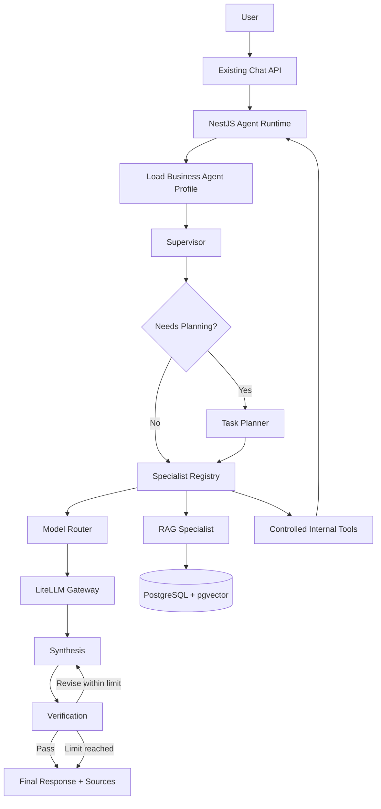

# Magnafic AI Agent Runtime

Magnafic AI uses one shared LangGraph runtime for all business-facing agents. Sales, Marketing, Finance, Legal, Production, and future agents are configurable profiles, not separate orchestration implementations.

## Business Agents vs Specialists

Business agents are user-visible roles such as `Magnafic AI`, `Sales Agent`, `Marketing Agent`, `Finance Agent`, `Legal Agent`, and `Production Agent`. They live in `BusinessAgentProfile` records with name, slug, department, instructions, capabilities, tools, model policy, and verification policy.

Internal specialists are reusable execution components such as RAG, analysis, writing, calculation, document, and research. Departments do not get duplicated specialist classes.

## Runtime Flow

1. Load the selected business-agent profile, defaulting to `magnafic-ai`.
2. Load tenant-safe company, project, profile, report, and knowledge context.
3. Supervisor produces structured classification: intent, complexity, capabilities, knowledge/research/calculation needs, and risk level.
4. Planner creates bounded structured steps when the request is not simple.
5. Model Router selects LiteLLM model aliases by policy, with optional fallbacks.
6. Specialist Registry executes allowed reusable specialists only.
7. Synthesis creates the user-facing answer through LiteLLM.
8. Verification checks grounding, completeness, caveats, contradictions, and risk policy.
9. AgentRun and AgentStep persist status/progress in PostgreSQL.

## LiteLLM Relationship

No LangGraph node uses provider API keys. All model calls go through the existing LiteLLM gateway. Model policy environment variables map runtime policies to LiteLLM model aliases.

## BullMQ Relationship

The runtime is currently synchronous for normal chat so stakeholder demos stay fast. AgentRun and AgentStep persistence are in place for polling-friendly async execution. The existing `ai-execution` queue remains the target for long-running research/report workflows in the next phase.

## RAG Relationship

The RAG Specialist calls the existing RAG context service, which performs organization/project scoped pgvector retrieval. Uploaded document content is treated as untrusted data and cannot override system instructions, tenant access controls, agent policies, or tool permissions.

## Adding a Business Agent

Add a `BusinessAgentProfile` row with a unique `slug`, instructions, capabilities, allowed specialists, allowed tools, model policy, and verification policy. No new graph implementation is required.

## Adding a Specialist

Implement `AgentSpecialist`, register it in `SpecialistRegistryService`, and add the capability to agent profiles that are allowed to use it.

## Adding a Model

Configure the model in LiteLLM, then set the corresponding policy variable such as `MODEL_POLICY_REASONING` or `MODEL_POLICY_WRITING`. The runtime does not store provider credentials.

## Adding an External Tool

Create a controlled server-side tool wrapper that validates tenant/project scope and permissions. Do not expose unrestricted shell, SQL, filesystem, or arbitrary code execution to the LLM.
