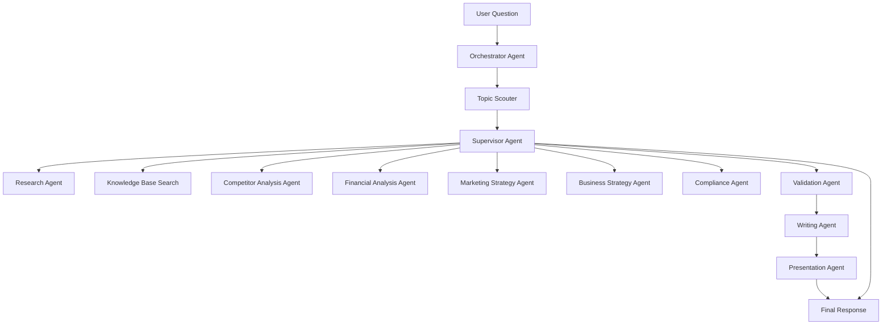

# Milestone 6: LangGraph Architecture

## Status

Drafted for approval.

## Goal

The agent system performs consulting workflows through specialized agents coordinated by a Supervisor Agent. Agents exchange data only through LangGraph state, which preserves traceability, replayability, and testability.

## Graph State

```ts
type ConsultingGraphState = {
  organizationId: string;
  projectId: string;
  userId: string;
  question: string;
  extractedTopics: string[];
  researchPlan: ResearchPlanState | null;
  webFindings: ResearchFindingState[];
  knowledgeFindings: KnowledgeFindingState[];
  analysisArtifacts: AnalysisArtifactState[];
  validationResults: ValidationResultState[];
  reportDraft: ReportDraftState | null;
  presentationDraft: PresentationDraftState | null;
  agentDecisions: AgentDecisionState[];
  errors: AgentErrorState[];
};
```

## Agent Catalog

- Topic Scouter: extracts themes, industries, questions, assumptions, and ambiguity.
- Research Agent: plans and gathers market research.
- Competitor Analysis Agent: identifies competitors, positioning, strengths, and risks.
- Financial Analysis Agent: estimates unit economics, market sizing, pricing, and financial implications.
- Marketing Strategy Agent: proposes segmentation, positioning, channels, and GTM motions.
- Business Strategy Agent: performs SWOT, PESTLE, Porter, and recommendation synthesis.
- Writing Agent: turns analysis into concise consulting-grade narrative.
- Compliance Agent: checks policy, legal sensitivity, unsupported claims, and regulated-domain risk.
- Presentation Agent: prepares slide-ready structure and speaker notes.
- Coding Agent: assists with technical artifacts when the project needs implementation support.
- Validation Agent: verifies citations, factual consistency, and confidence.
- Orchestrator Agent: normalizes graph inputs and dispatches workflow setup.
- Supervisor Agent: selects next agent, evaluates completion, and terminates workflow.

## Execution Flow



## Model Routing

- Agents request capabilities, not providers.
- `ModelGateway` resolves capability requirements to LiteLLM model keys.
- Provider and model configuration lives in the database and environment configuration.
- Adding a future model must not require application code changes.

## Persistence

- Each graph execution creates an `AgentRun`.
- Each provider invocation creates an `AiExecution`.
- Intermediate graph state is periodically checkpointed.
- Failures are persisted with structured error metadata.

## Guardrails

- Agents cannot bypass the Supervisor.
- Agents cannot directly mutate database records.
- Agents cannot call provider SDKs directly.
- Validation gates must run before final report generation.

