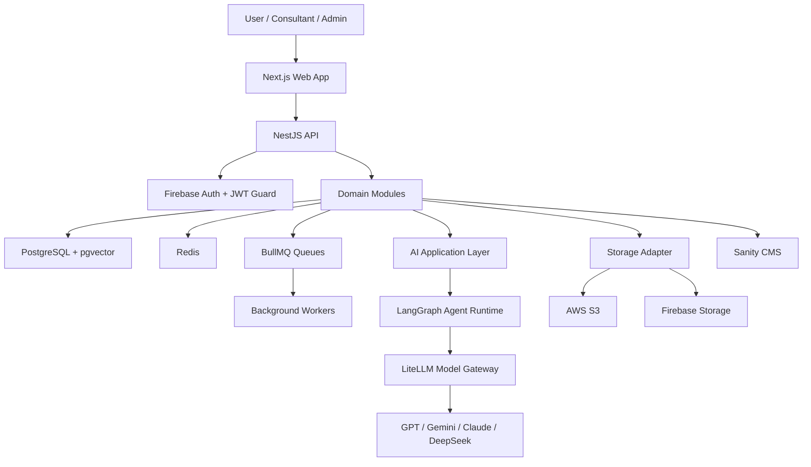

# Milestone 2: System Architecture

## Status

Approved.

## Architecture Style

The platform uses a modular monolith architecture with Clean Architecture layering inside each backend module. Modules are independently structured, testable, and replaceable without direct coupling to other module internals.

## Runtime View

## Backend Layers

- Presentation: controllers, DTOs, validation pipes, guards, Swagger metadata.
- Application: use cases, commands, queries, orchestration services.
- Domain: entities, value objects, domain services, domain events.
- Infrastructure: Prisma repositories, Redis, BullMQ, LiteLLM, storage adapters, external clients.

## Core Backend Modules

- Authentication
- Users
- Organizations
- Projects
- Research
- AI
- Knowledge Base
- Agents
- Reports
- Conversations
- Prompt Library
- Model Management
- Billing
- Notifications
- Audit Logs
- Admin

## Frontend Layers

- `app`: route groups, layouts, server components, metadata.
- `features`: business-facing feature slices.
- `components`: reusable presentation components.
- `hooks`: cross-feature React hooks.
- `lib`: clients, adapters, and framework utilities.
- `stores`: Zustand client state.
- `styles`: Tailwind global styling.

## AI Boundary

- Application code never calls model providers directly.
- Model execution flows through a `ModelGateway` abstraction.
- LiteLLM is the only model-provider integration point.
- LangGraph agents communicate through graph state only.
- The Supervisor Agent decides execution order and termination.

## Security Boundary

- Firebase Authentication verifies external identity.
- JWT guards secure platform API access.
- Role Based Access Control protects application actions.
- Tenant isolation is enforced in repositories and use cases.
- Audit logs are written for security-sensitive events.
- Secrets are externalized through environment-specific secret management.

