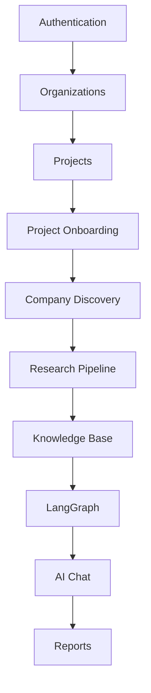
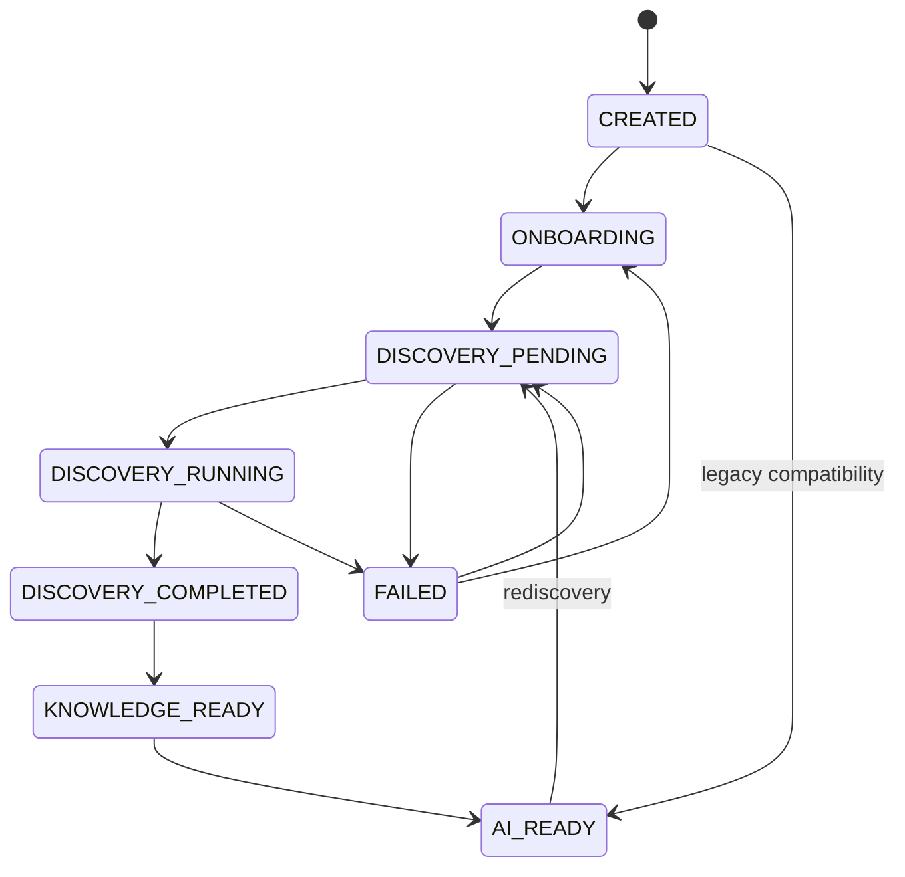
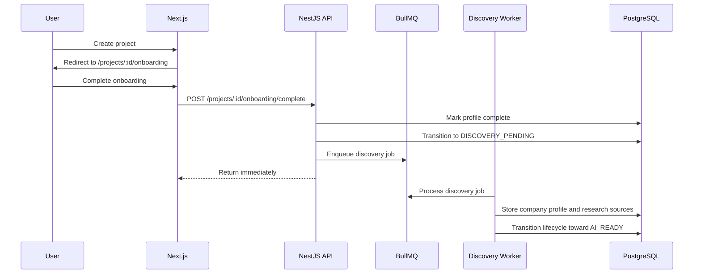

# Milestone 13: Project Onboarding and Company Discovery

## Status

Implemented as an additive foundation.

## Placement in Existing Roadmap

## Core Rules

- Project creation remains compatible with the existing flow.
- New projects should enter onboarding before research.
- Research should not start until onboarding completes.
- Company-specific AI context should not be used until discovery completes.
- Discovery is asynchronous and queued through BullMQ.
- Discovery outputs become research sources and knowledge inputs.

## Project Lifecycle

## Sequence

## Module Boundaries

- `project-profile`: onboarding data persistence.
- `onboarding`: lifecycle transition and discovery enqueue orchestration.
- `discovery-jobs`: queue job persistence, status, retry.
- `company-discovery`: independent discovery services.
- `website-analysis`: SSRF-aware website URL validation.
- `company-profile`: generated and user-reviewed company context.

