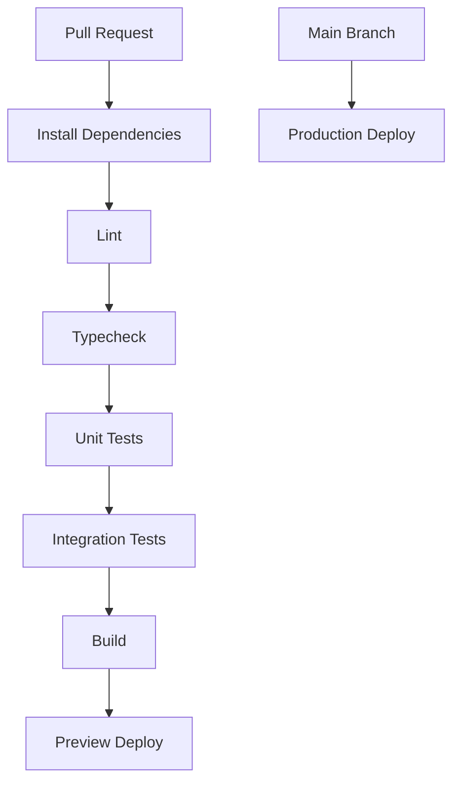

# Milestone 9: Deployment Architecture

## Status

Drafted for approval.

## Environments

- Local: Docker Compose for PostgreSQL, pgvector, and Redis.
- Preview: Vercel preview deployments for web, Railway preview environments for API and workers.
- Production: Vercel for web, Railway or containerized runtime for API/workers, managed PostgreSQL, managed Redis, cloud object storage.

## Deployment Units

- `apps/web`: Next.js frontend deployed to Vercel.
- `apps/api`: NestJS API deployed as a stateless service.
- `services/agent-runtime`: LangGraph worker runtime.
- `services/document-processing`: document parsing and embedding worker.
- `services/notification-worker`: notification and scheduled-report worker.
- PostgreSQL with pgvector.
- Redis for BullMQ, cache, and rate-limit state.

## CI/CD Pipeline

## Secrets

- Secrets must not be committed.
- Environment-specific secrets are configured through hosting providers.
- Runtime validates required environment variables at startup.
- AI provider keys are only consumed by the LiteLLM gateway boundary.

## Storage

- Storage is accessed through a provider-neutral storage port.
- AWS S3 and Firebase Storage are infrastructure adapters.
- Business logic stores object references, not provider-specific SDK metadata.

