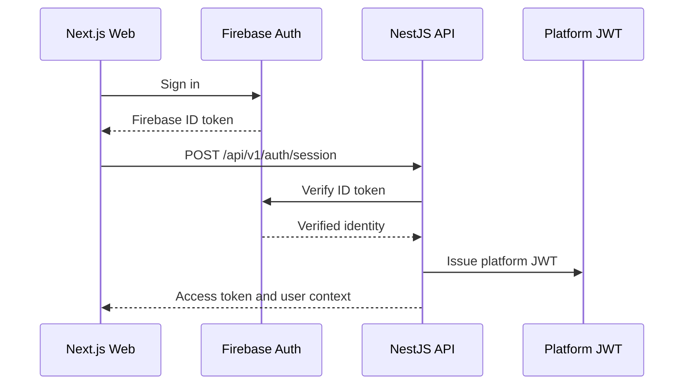

# Milestone 11: Authentication, RBAC, and Tenant Context

## Status

Drafted and implemented as foundational scaffolding.

## Authentication Flow

## Security Boundaries

- Firebase Authentication is the external identity provider.
- Platform JWTs are the API authorization credential.
- RBAC is enforced through guards and route metadata.
- Tenant context is resolved from `X-Organization-Id`.
- Public routes must opt out explicitly with `@Public()`.

## Roles

- `SUPER_ADMIN`
- `ADMIN`
- `CONSULTANT`
- `CLIENT`
- `VIEWER`

## Guard Order

1. `JwtAuthGuard`
2. `RolesGuard`
3. `TenantContextGuard`

## Design Rules

- Controllers do not parse JWTs directly.
- Business use cases receive authenticated context, not raw requests.
- Firebase SDK usage is isolated behind an identity-provider port.
- JWT issuance is isolated behind a token-service port.
- Tenant context must be explicit for organization-scoped actions.

